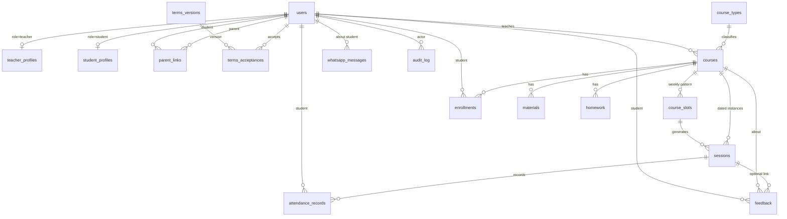

# MCA Academy — Implementation Plan

Planning pass for the Education Center Management System, per `agent-planning-brief.md`.
Reference UI/permissions prototype: `education-management-system.jsx` (in-memory React, not the target architecture).

**Status: P0–P9 and P11 delivered. P10 (deploy) is prepared and needs your server.**
Open questions 1–5 and 7 are settled (§8); 6 and 8–13 remain and are carried
into `docs/HANDOVER.md`.
559 tests passing, `ruff` clean. **57 of 62 brief requirements met** —
traced line by line in `docs/ACCEPTANCE.md`, with the two deliberate deviations
and three deferrals explained there.
One thing still needs *you*, not code: a **native Arabic review** of the
catalogue (`flask export-translations`).

Written to be handed to an implementing agent. §6 is the executable phase/sprint breakdown; §7 is the conventions that agent must follow.

Decisions already locked by the owner:

| Decision | Choice |
|---|---|
| UI | Flask + Jinja2 server-rendered, HTMX for interactivity |
| Language | Bilingual Arabic / English with a user toggle, RTL when Arabic |
| Database | SQLite in dev, Postgres-ready via SQLAlchemy; Postgres on deploy |
| WhatsApp | Full composer + log; **sent by hand** from the assistant's own WhatsApp via a click-to-chat link. No API, no credentials |

---

## 1. Tech stack

| Layer | Choice | Why |
|---|---|---|
| Framework | Flask 3.x, app-factory + Blueprints | Asked for; blueprints keep the six role areas separable |
| ORM | SQLAlchemy 2.x + Flask-SQLAlchemy | Same models on SQLite and Postgres |
| Migrations | Alembic (Flask-Migrate) | Terms text and course types get versioned/seeded through migrations |
| Auth | Flask-Login, server-side cookie sessions | Server-rendered app — no reason to hand out JWTs |
| Passwords | Argon2id (`argon2-cffi` via passlib) | Current default; bcrypt acceptable fallback |
| Forms/CSRF | Flask-WTF | Every mutating form is CSRF-protected; this is not optional for cookie auth |
| i18n | Flask-Babel | `.po` catalogs for AR/EN, `dir="rtl"` driven by locale |
| Interactivity | HTMX + a little Alpine.js | Attendance marking, conflict checking, live search — no Node build step |
| CSS | Hand-written CSS with the prototype's brand tokens (navy `#16233F`, gold `#C99A3D`, cream `#F7F5F0`) + logical properties (`margin-inline-start` etc.) | Logical properties mean one stylesheet works LTR and RTL |
| Scheduled jobs | `flask prepare-daily-updates` CLI command, optional, driven by system cron | Survives app restarts and redeploys, unlike an in-process APScheduler. **Composes only — nothing sends without a person** |
| WhatsApp | A `wa.me` click-to-chat link the assistant opens and sends themselves | Removed the Cloud API at the owner's request: no verification wait, no credential to hold, and no delivery confirmation either (ACCEPTANCE §9.6) |
| Hosting | Single small VPS (Hetzner/DigitalOcean) or Railway/Render + managed Postgres | Low hundreds of users; no need for anything elastic |
| Server | gunicorn behind nginx (or the PaaS router), TLS via Let's Encrypt | — |

Uploaded course cover images go to local disk (`instance/uploads/`) behind an authenticated route, with the path stored in the DB. If we move to a PaaS with an ephemeral filesystem, this becomes S3-compatible object storage — the storage call sits behind one small module so it's a one-file swap.

### Project layout

```
app/
  __init__.py            # create_app(), extension init, blueprint registration
  config.py              # Dev / Prod / Test configs
  models/                # one module per aggregate
  services/              # ALL business rules + authorization live here
    auth.py  courses.py  scheduling.py  attendance.py
    enrollments.py  whatsapp.py  terms.py  audit.py
  blueprints/
    auth/  admin/  assistant/  teacher/  portal/   # portal = student+parent
  templates/             # base.html + per-blueprint folders + _partials/ for HTMX
  static/
  translations/          # ar/ and en/ LC_MESSAGES
  cli.py                 # seed, create-admin, send-daily-updates, generate-sessions
migrations/
tests/
```

**Rule the codebase enforces:** route handlers never query models directly. They call a service function that takes `current_user` as its first argument and returns only rows that user is allowed to see. That is what makes §4 real instead of decorative.

---

## 2. Data model

### 2.1 The one significant departure from the brief

The brief describes attendance "per session" but its suggested entity list only has *course schedule slots*. A weekly slot ("Sunday 16:00") is a recurring pattern, not a thing you can attend. The prototype papers over this by keying attendance on `(course, date)`.

**I propose materializing a `sessions` table** — concrete dated session instances generated from a course's slots plus its start date and its type's total session count.

Without it, these requirements have nowhere to live:
- "session 7 of 10" progress toward a round
- teacher-cancelled sessions being *rescheduled* (a session whose date moves)
- the teacher-absence / student-absence payout rules in the teacher terms
- makeup sessions, which by definition don't sit on a weekly slot
- distinguishing "no session today" from "session today, nobody marked it"

It costs one generator function and one extra table. I recommend it; flagging it because it's a deliberate deviation from the brief's entity list.

Second, smaller departure: **teacher attendance lives on the `sessions` row** (`teacher_status`, `teacher_checked_in_at`), not in a parallel `attendance_records` table with `type='teacher'` as the prototype does. There is exactly one teacher per session, so a separate row is redundant and makes the "did this session actually run" query awkward.

### 2.2 Schema



**users** — `id, role(admin|assistant|teacher|student|parent), full_name, phone(unique, E.164), username(=phone, unique), password_hash, must_change_password(bool), locale(ar|en), is_active, created_by_id, created_at, updated_at`

**teacher_profiles** — `user_id(PK/FK), subject, payout_share(default 0.60), notes`
**student_profiles** — `user_id(PK/FK), school, grade, notes`
**parent_links** — `parent_id, student_id, relation` · unique(parent_id, student_id) — a true many-to-many, so one parent covers several children *and* a child can have two parents

**course_types** — `id(1..6), code, label_en, label_ar, sessions_per_week, cycle(month|round), total_sessions` — seeded by migration, **no CRUD route exists for this table**, which is how "types 1–6 are not freely editable" gets enforced.

**courses** — `id, name, course_type_id, teacher_id, description, cover_image_path, price_egp, trial_enabled, status(draft|active|archived), start_date, created_by_id, timestamps`

**course_slots** — `id, course_id, weekday(0=Sat..6=Fri), start_time(local wall clock), duration_minutes(default 90)`
→ `duration_minutes` is what makes "overlapping time" checkable; see §3.

**sessions** — `id, course_id, slot_id(nullable — null = makeup/ad-hoc), session_date, start_time, end_time, sequence_no, status(scheduled|held|cancelled_by_teacher|cancelled_by_center|rescheduled), rescheduled_to_id(nullable), teacher_id, teacher_status(present|absent|late|null), teacher_checked_in_at, recorded_by_id, notes`

**enrollments** — `id, course_id, student_id, booking_status(trial|booked|not_booked), payment_status(paid|unpaid), amount_due, enrolled_at, created_by_id` · unique(course_id, student_id)

**attendance_records** — `id, session_id, student_id, status(present|absent|late|excused), checked_in_at(timestamp), recorded_by_id, recorded_at` · unique(session_id, student_id)

**homework** — `id, course_id, session_id(nullable), for_date, text, created_by_id, created_at`
**feedback** — `id, course_id, student_id, session_id(nullable), for_date, text, created_by_id, created_at`
**materials** — `id, course_id, title, url, created_by_id, created_at`

**terms_versions** — `id, audience(teacher|student_parent), version(int), body_ar, body_en, effective_from, is_current` — seeded with v1 from the Arabic texts already in the prototype
**terms_acceptances** — `id, user_id, terms_version_id, accepted_at, ip, user_agent` · unique(user_id, terms_version_id)
→ The gate is "does an acceptance exist for the *current* version for my audience", not a boolean on the user. Bumping the text to v2 automatically re-prompts everyone, which is exactly what the brief asked for.

**whatsapp_messages** — `id, student_id, recipient_id, to_phone, body, locale, status(prepared|sent), batch_date, created_by_id(null=cron), sent_by_id, sent_at, created_at, updated_at`

> Revised when the Cloud API was removed. Every provider, error and delivery
> column went with it: with sending done by hand there is nothing to write
> them, and a `delivered_at` nobody can fill reads as evidence while holding
> none. `status` is down to what the centre can actually observe.

**audit_log** — `id, actor_id, action, entity_type, entity_id, before_json, after_json, ip, created_at`

### 2.3 Timezone

All session times are **Africa/Cairo**. Note Egypt reintroduced DST in 2023 (last Friday of April → last Thursday of October), so this is a live concern, not a formality.

- `session_date` + `start_time` are stored as **naive local wall-clock**. "Sunday 16:00" must stay 16:00 across a DST boundary — converting to UTC would silently shift half the year's sessions by an hour.
- All *event* timestamps (`checked_in_at`, `accepted_at`, `sent_at`, audit rows) are stored **timezone-aware UTC** and rendered in Cairo time.

### 2.4 Passwords & phone numbers

- **Phone:** input accepted as local (`01xxxxxxxxx`) or international, normalized to E.164 (`+201xxxxxxxxx`) on save via `phonenumbers`. Login normalizes before lookup, so either form works at the login box. Unique index on the normalized value.
- **Generated password:** 10 characters from a 32-char alphabet with ambiguous glyphs removed (no `0 O 1 l I`), via `secrets.choice` — ~50 bits. Hashed immediately; the plaintext exists only in the response that renders the creation confirmation and is never written to the DB, the logs, or a flash cookie.
- `must_change_password=True` on every generated account. Login order is: **authenticate → forced password change → terms acceptance → dashboard.** No route reachable until both gates clear (enforced in a `before_request` hook, not in templates).
- Because the plaintext is genuinely unrecoverable, **assistants and admins get a "regenerate password" action** on any account they created. The brief doesn't mention this and the system is unusable without it — an assistant who closes the tab before writing the password down has otherwise locked the family out permanently.

---

## 3. Scheduling conflict rule

The brief says a teacher can't hold two slots on the same day at **overlapping** times. The prototype only compares exact-equal start strings, so a 16:00 and a 16:30 class collide in reality but pass its check.

Implementation:
- Every slot carries `duration_minutes`, so a slot is a real interval `[start, start + duration)`.
- Overlap test: `a.start < b.end AND b.start < a.end` on the same weekday.
- Checked in `services/scheduling.py::assert_no_conflicts(teacher_id, slots, exclude_course_id)`, called on **course create, course edit, teacher reassignment, and slot edit** — all four paths, since the brief calls out edits specifically.
- The error names the colliding course, day, and time: *"Mr. Ahmed Fathy is already teaching «Math — GPA Booster» on Sunday 16:00–17:30, which overlaps 16:30–18:00."*
- The same check runs live over HTMX as the assistant edits the slot form, before submit.

Two things to decide (§8): whether **students** should also be conflict-checked across their enrolled courses, and whether **rooms** are a constraint. Neither is in the brief; both are cheap to add now and awkward to retrofit.

---

## 4. Authorization model

Enforced in services, not templates. Every scoped read goes through a helper that filters by ownership and raises 404 (not 403 — a 403 confirms the ID exists) when the row is out of scope.

| | Admin | Assistant | Teacher | Student | Parent |
|---|---|---|---|---|---|
| Assistants CRUD | ✅ | — | — | — | — |
| Courses CRUD | ✅ | ✅ | read own | read enrolled | read child's |
| Teacher/student/parent accounts | ✅ | ✅ | — | — | — |
| Student attendance | ✅ | ✅ | own courses | read own | read child's |
| Teacher attendance | ✅ | ✅ | (v2: self check-in) | — | — |
| Homework | ✅ | ✅ | read own courses | read enrolled | read child's |
| Feedback | ✅ | ✅ | read own courses | read own | read child's |
| Materials | ✅ | ✅ | CRUD own courses | read enrolled | read child's |
| Booking / payment status | ✅ | ✅ | — | read own | read child's |
| WhatsApp send + log | ✅ | ✅ | — | — | read own messages |
| Audit log | ✅ | — | — | — | — |

Scoping helpers: `courses_for(user)`, `students_for(user)`, `sessions_for(user)`, `get_course_or_404(user, id)`. A teacher's session simply cannot produce another teacher's course object — there is no code path that returns one.

**Assumption flagged:** admin is treated as a strict superset of assistant (the brief says "full read/write access to all data" but its own open-questions list asks whether admin can act as an assistant). Easy to narrow later; hard to widen.

---

## 5. Route surface

Bilingual routes stay in one URL space; locale is a user preference plus a `?lang=` override, not a URL prefix.

**Auth** — `GET/POST /login`, `POST /logout`, `GET/POST /password/change` (forced), `GET/POST /terms` (gate), `GET/POST /me/language`

**Admin** — `/admin/` overview · `/admin/assistants` list/create · `POST /admin/users/<id>/regenerate-password` · `POST /admin/users/<id>/deactivate` · `/admin/audit` · `/admin/terms` (list versions, publish new version)

**Assistant** (admin has all of these too)
- Courses: `/courses`, `/courses/new`, `/courses/<id>`, `/courses/<id>/edit`, `POST /courses/<id>/slots`, `POST /courses/check-conflicts` (HTMX), `POST /courses/<id>/generate-sessions`
- People: `/people/teachers`, `/people/students` (create student → auto-creates or links parent), `/people/<id>`
- Enrollment: `POST /courses/<id>/enroll`, `PATCH /enrollments/<id>` (booking + payment status)
- Attendance: `/attendance`, `/sessions/<id>/attendance` (mark students + teacher, HTMX per row), `/attendance/log` (filter by teacher/course/date)
- Homework & feedback: `/courses/<id>/homework`, `/courses/<id>/feedback`
- WhatsApp: `/whatsapp` (per-student preview, send button, log), `POST /whatsapp/open/<student_id>` (records the hand-off, then redirects to `wa.me`), `POST /whatsapp/prepare-all`

**Teacher** — `/teacher/` · `/teacher/courses` · `/teacher/courses/<id>` · `/teacher/calendar` (weekly) · `/teacher/materials` CRUD · `/teacher/sessions/<id>/attendance`

**Portal** (student and parent share templates; parent gets a child switcher + WhatsApp history)
`/portal/` · `/portal/courses/<id>` · `/portal/attendance` · `/portal/homework` · `/portal/feedback` · `/portal/messages` (parent only) · `POST /portal/child/<id>/select` (parent only)

**Webhooks** — none. The delivery-status webhook was deleted with the Cloud API; every route in the app now requires a session.

---

## 6. Execution plan — phases and sprints

Twelve phases, P0 through P11, each broken into sprints. Every sprint states what to build, which files it owns, and the condition that proves it's finished. Phases run in order; sprints inside a phase may run in parallel unless a dependency is noted.

Rough total: **4–5 weeks** of focused work. WhatsApp go-live is gated on Meta approval, not on us.

**Phase map**

| Phase | Name | Est. | Gate to leave it |
|---|---|---|---|
| P0 | Foundation & tooling | 1–2 d | ✅ **Done** — bilingual shell runs, `pytest` green |
| P1 | Identity, auth, onboarding gates | 3–4 d | ✅ **Done** — role isolation proven by test |
| P2 | Catalog: courses, slots, conflicts | 3–4 d | ✅ **Done** — overlap rejected with a named-course error |
| P3 | Sessions & attendance | 4–5 d | ✅ **Done** — timestamped attendance, teacher scoped to own sessions |
| P4 | Homework, feedback, materials | 2 d | ✅ **Done** — feedback visible to exactly one family |
| P5 | Enrollment, booking, payment | 1–2 d | Statuses editable by staff, read-only on portal |
| P6 | WhatsApp | 3–4 d | ✅ **Done**, then **revised** — API removed, sending is manual |
| P7 | Dashboards & portal polish | 3–4 d | ✅ **Done** — every role has a real landing page in both languages |
| P8 | Audit trail & oversight | 2 d | ✅ **Done** — every mutating route provably classified |
| P9 | Security hardening | 2–3 d | ✅ **Done** — full role × route authorization matrix passes |
| P10 | Deploy & UAT | 2 d | ⏸ **Prepared** — needs a host; see `docs/RUNBOOK.md` |
| P11 | Final acceptance audit | 1–2 d | ✅ **Done** — every requirement traced to code + test |

---

### P0 — Foundation & tooling ✅ delivered

No user-visible features. Everything after this depends on P0 being solid, so don't rush it.

> **Delivered.** 131 tests passing, `ruff` clean, migration verified up *and* down, and the flow exercised in a real browser (login → forced password change → dashboard, in Arabic RTL).
>
> **Deviations from the sprint text, all deliberate:**
> - Terms v1 is published by an idempotent `flask seed-terms` command reading `app/seeds/terms_v1.py`, not by a data migration. Migrations stay schema-only and re-seeding is safe on every deploy.
> - Status enums use `StrEnum` (Python 3.12) rather than a `str`/`Enum` mixin.
> - Python 3.12, not the system 3.14 — several dependencies have no 3.14 wheels yet. Virtualenv is `.venv-flask/`.
>
> **One trap worth knowing about, fixed in `tests/conftest.py`:** the `app` fixture keeps one app context open per test so model objects stay attached, but Flask *reuses* an already-pushed context instead of making a fresh one per request. That leaves `g` shared, so `g._login_user` (Flask-Login) and `g._flask_babel` (Flask-Babel 4) persisted across requests — the first request's user and locale stuck for the rest of the test, and the authorization suite passed while every client was silently the same user. A hook clears both caches at the start of each request, and `TestGRuleCompliance::test_identity_does_not_leak_between_clients` fails loudly if it is ever removed.

**S0.1 — Repo, tooling, config**
- Build: `pyproject.toml` (or `requirements.txt` + `requirements-dev.txt`), `.gitignore` covering `.venv*/ instance/ *.db __pycache__ .env`, ruff + black config, `.env.example`, `Config`/`DevConfig`/`TestConfig`/`ProdConfig` classes reading from env, `create_app()` factory, `GET /healthz`.
- Files: `app/__init__.py`, `app/config.py`, `wsgi.py`, `.env.example`
- Done when: `flask run` serves `/healthz` → `{"status":"ok"}`; no secret has a hardcoded default outside `DevConfig`.

**S0.2 — Data layer bootstrap**
- Build: Flask-SQLAlchemy + Flask-Migrate init, declarative base with `id` / `created_at` / `updated_at` mixins, Python enums for every status column in §2.2, first (empty) Alembic revision.
- Files: `app/extensions.py`, `app/models/base.py`, `app/models/enums.py`, `migrations/`
- Done when: `flask db upgrade` runs clean on a fresh SQLite file and on a Postgres URL.

**S0.3 — Layout & design system**
- Build: `base.html` with the prototype's brand tokens as CSS custom properties, sidebar + topbar shell, flash-message region, HTMX + Alpine included locally (no CDN), reusable partials for card / pill / button / form-field matching the prototype's look.
- Files: `app/templates/base.html`, `app/templates/_partials/*`, `app/static/css/app.css`
- Done when: the shell renders identically in LTR and RTL because layout uses logical properties (`margin-inline-start`, `padding-inline`, `text-align: start`) — **no bare `left`/`right` anywhere in the stylesheet.**

**S0.4 — Bilingual i18n**
- Build: Flask-Babel, `babel.cfg`, `ar`/`en` catalogs, locale selector (user preference → `?lang=` override → `Accept-Language` → default), `<html lang dir>` driven by locale, language toggle in the topbar, `POST /me/language`.
- Files: `app/i18n.py`, `app/translations/`, `babel.cfg`
- Done when: toggling to Arabic flips the whole shell to RTL and persists across requests for a logged-out visitor (session) and a logged-in user (DB).

**S0.5 — Test harness**
- Build: pytest fixtures — `app`, `client`, `db_session` (transaction rollback per test), and a `users` factory that mints one user of each of the five roles plus a logged-in client per role.
- Files: `tests/conftest.py`, `tests/factories.py`, `tests/test_smoke.py`
- Done when: `pytest` is green and a test can do `as_teacher.get("/admin/")` in one line. **Every later sprint's "done when" is written as a test using these fixtures.**

**S0.6 — Audit + storage primitives**
- Build: `audit_log` table, `services/audit.py::record(actor, action, entity, before, after)` with JSON diffing, and a storage module wrapping file writes (local disk now, object storage later behind the same two functions).
- Files: `app/models/audit.py`, `app/services/audit.py`, `app/services/storage.py`
- Done when: `record()` writes a row with a usable before/after diff. Built now — not in P8 — so every sprint can instrument as it goes rather than retrofitting.

---

### P1 — Identity, auth, onboarding gates ✅ delivered

> **Delivered**, with these decisions recorded:
>
> - **Open question 1 built as recommendation (b)**, behind `FAMILY_SHARED_PHONE_MODE` (`parent_only` default, `require_distinct` available). One family phone → the parent gets the login, the student is a full record without one. `users.phone`, `username` and `password_hash` are nullable to allow this, guarded by a check constraint that a username always implies a password.
> - **Session protection is `basic`, not `strong`.** Strong destroys the session whenever the client IP or user agent changes — parents on Egyptian mobile data hopping between wifi and 4G would be signed out mid-visit, for no real gain at this data sensitivity. Pinned by `TestSessionProtection`.
> - **Flask-Login's `login_message` is translated.** Its English default would otherwise appear verbatim in the Arabic UI, and only on the redirect from a protected page, which happy-path tests never hit.
> - **Still open:** `body_en` on both terms versions is null pending open question 6, so English users are shown the Arabic text (rendered RTL inside an otherwise LTR page — covered by a test).

**S1.1 — User model & credentials service**
- Build: `users` + the three profile tables + `parent_links` per §2.2. Phone normalization to E.164 via `phonenumbers` (accepts `01xxxxxxxxx`). Argon2id hashing. Password generator per §2.4 (10 chars, ambiguous glyphs stripped, `secrets`).
- Files: `app/models/user.py`, `app/services/auth.py`
- Done when: `01011112222` and `+201011112222` resolve to the same user; a generated password never appears in the DB, in `repr()`, or in any log line.

**S1.2 — Login / logout**
- Build: Flask-Login wiring, login form (phone + password) styled per the prototype, secure session cookies (`HttpOnly`, `SameSite=Lax`, `Secure` in prod), generic failure message that doesn't reveal whether the phone exists, basic per-IP rate limit.
- Done when: wrong password and unknown phone produce byte-identical responses.

**S1.3 — Forced password change gate**
- Build: `before_request` hook redirecting any user with `must_change_password=True` to `/password/change`, with only that route and logout reachable.
- Done when: a test proves a freshly created user hitting *any* other URL lands on the change form.
- Depends on: S1.1.

**S1.4 — Terms versioning model & seed**
- Build: `terms_versions` + `terms_acceptances`, seed migration inserting v1 for both audiences with the Arabic texts from `education-management-system.jsx` (lines 16–57), `services/terms.py::current_version_for(user)` and `needs_acceptance(user)`.
- Done when: acceptance is resolved by *querying for an acceptance row matching the current version* — never by a boolean on the user — so publishing v2 re-prompts everyone automatically.
- **Blocked on open question 6** (English terms text). Build the AR side; leave `body_en` nullable and fall back to Arabic until answered.

**S1.5 — Terms gate screen**
- Build: full-page (not dismissible-modal) terms screen, RTL, full scrollable text, required checkbox before the continue button enables, logout the only alternative exit. `before_request` hook ordered *after* the password gate.
- Done when: a teacher/student/parent who hasn't accepted cannot reach any dashboard URL by typing it directly; admin and assistant are never shown the screen.
- Depends on: S1.3, S1.4.

**S1.6 — Account creation & credential reveal**
- Build: admin → assistant. Assistant → teacher. Assistant → student, which in the same transaction links an existing parent by phone or creates a new one. One-time credential reveal rendered in the POST response only. "Regenerate password" action per §2.4.
- Done when: creating a student whose parent phone already belongs to a parent *links* rather than duplicating; the same phone belonging to a teacher is refused with a clear message; the plaintext password appears in exactly one HTTP response and nowhere else.
- ✅ **Answered (Q1).** Recommendation (b) shipped: parent-only account when one phone is supplied, behind `FAMILY_SHARED_PHONE_MODE`.

**S1.7 — Authorization primitives**
- Build: `@require_role(...)` decorator, the scoping helpers named in §4 (`courses_for`, `students_for`, `sessions_for`, `get_course_or_404`), and the 404-not-403 policy.
- Files: `app/services/scoping.py`, `app/decorators.py`
- Done when: a test asserts every role's access to a representative route of every other role's blueprint. This test file grows in every later phase and becomes the P9 matrix.

---

### P2 — Catalog: courses, slots, conflicts ✅ delivered

> **Delivered.** The prototype's conflict bug is fixed and pinned: 16:00–17:30
> versus 16:30–18:00 now collides, back-to-back at 17:30 does not, and the error
> names teacher, course, day and both time ranges in the reader's language.
> Checked on all four mutation paths, including the sneakiest — reassigning a
> course to an already-busy teacher without touching its times.
>
> **Scope added beyond the sprint list:** the `enrollments` table and an
> enrol/unenrol action. A course no student can join is invisible to the portal
> and unusable by P3 attendance, so S2.6's own exit criterion could not be met
> without it. Booking/payment *editing* and the portal's status display remain
> P5 as planned.
>
> **Three bugs found here that the test suite had not been shaped to catch:**
>
> 1. **`select_locale` read `session` unconditionally**, so any translated text
>    built outside a request crashed. That would have taken down P3's session
>    generator and P6's WhatsApp job, not just conflict messages.
> 2. **Imported Jinja macros get no template context**, so a shared macro using
>    a `context_processor` value raised `UndefinedError` — but only when the
>    macro body actually ran, which no test did until a course list had a course
>    in it. Pure helpers are now Jinja globals, and `TestRendering` fetches every
>    course page *with data present*.
> 3. **Babel silently skips `_`-prefixed directories.** Every shared macro lived
>    in `_partials/`, so its strings were never extracted, never entered the
>    catalogue, and rendered in English with nothing failing. Directory renamed
>    to `partials/`, and `tests/test_i18n_coverage.py` now walks the source tree
>    itself rather than trusting the catalogue.
>
> All three shared a shape worth remembering for later phases: **the failure was
> invisible to a green suite.** Prefer tests that render the real page with real
> data over tests that only exercise the service beneath it.

**S2.1 — Course types seed**
- Build: `course_types` seeded by migration with the six types from the brief. **No create/edit/delete route exists for this table** — that absence is how "types 1–6 are not freely editable" is enforced.
- ✅ **Answered (Q2, Q3).** Type 6 seeds `sessions_per_week = 2`. The type label is what students see, so `label_ar` / `label_en` are user-facing copy and need Arabic wording reviewed, not just transliterated.

**S2.2 — Course CRUD**
- Build: create/edit/archive, cover image upload through `services/storage.py` with type + size validation, served via an authenticated route (never a raw static path).
- Done when: a course created by an assistant appears immediately on the enrolled students' and parents' dashboards, per the brief.

**S2.3 — Slot editor**
- Build: slot rows sized by the selected type's `sessions_per_week` — picking a 2/week type renders exactly two day+time rows. `duration_minutes` per slot.
- ✅ **Answered (Q4).** 90 minutes for every course. Stored per slot so it can vary later; the form defaults it and does not ask.

**S2.4 — Conflict detection service**
- Build: `services/scheduling.py::assert_no_conflicts(teacher_id, slots, exclude_course_id)` using the half-open interval test from §3. Wired into **all four** mutation paths: course create, course edit, teacher reassignment, slot edit.
- Done when: a test proves 16:00–17:30 and 16:30–18:00 on the same weekday collide (the prototype's exact-match check passes this pair, which is the bug being fixed), and the error message names the colliding course, day, and time range.

**S2.5 — Live conflict preview**
- Build: HTMX `POST /courses/check-conflicts` re-rendering a warning partial as the assistant edits the slot form.
- Done when: the warning appears before submit and the server still re-validates on submit — the live check is a convenience, never the enforcement point.

**S2.6 — Scoped course views**
- Build: course list/detail for assistant (all), teacher (own only), student (enrolled only), parent (children's only), all through S1.7 helpers.
- Done when: a teacher requesting another teacher's course ID gets 404.

---

### P3 — Sessions & attendance ✅ delivered

> **Delivered.** Sessions generate from the course start date and the type's
> total, idempotently; attendance carries a real timestamp for students and
> teachers; cancel/reschedule/make-up all work; history is queryable in both
> directions with filters.
>
> **Key design points, and why:**
> - **Idempotency is keyed on `sequence_no`, not date.** Keying on date would
>   resurrect a rescheduled session at its original slot every time generation
>   re-ran.
> - **Rescheduling keeps the original row** (status `rescheduled`, pointing at
>   the replacement) rather than mutating its date. An attendance record must
>   not silently change the date it refers to.
> - **Cancellation records *who* cancelled.** The teacher terms make a
>   teacher-cancelled session owed back to the student while a student absence
>   is forfeited — the distinction is unrecoverable if not captured at the time.
> - **Re-marking updates one row and audits the change.** An attendance dispute
>   needs one authoritative record plus its history, not a pile of contradicting
>   rows.
> - **`checked_in_at` is only set for present/late.** Stamping an arrival time
>   on someone marked absent is nonsense that would corrupt any later report.
>
> **Two bugs found, both invisible to a green suite (the P2 pattern again):**
>
> 1. **`UtcDateTime`.** SQLite has no timezone type, so `DateTime(timezone=True)`
>    returned *naive* datetimes — while Postgres returns aware ones. Anything
>    calling `.astimezone()` on the naive value silently assumes the server's
>    zone, which is how attendance times end up hours wrong in one environment
>    and right in the other. A `TypeDecorator` now normalises to aware UTC on
>    every backend. `tests/test_timezone.py` covers this plus the wall-clock
>    rule across Egypt's April DST boundary.
> 2. **`_(status.value)` translates nothing.** gettext extraction is static, so
>    a runtime value yields no msgid: the string never enters the catalogue and
>    renders in English forever, and the i18n coverage tests cannot see it
>    because there is no literal to compare against. Enum text now lives in
>    `app/labels.py` with the literals written out, and a new coverage test
>    fails if any template goes back to translating a `.value`.

**S3.1 — Session generation**
- Build: `services/scheduling.py::generate_sessions(course)` materializing dated sessions from slots + start date + the type's `total_sessions`, numbered `sequence_no` 1..n. Idempotent — re-running never duplicates. Exposed as a course action and a `flask generate-sessions` CLI command.
- ✅ **Answered (Q5).** Assistant sets `start_date` per course; the whole round generates at once.
- Done when: a 2/week 10-session course produces exactly 10 rows on the right weekdays, and running it twice still produces 10.

**S3.2 — Session lifecycle**
- Build: cancel (by teacher vs by center — the distinction drives the payout rules in the teacher terms), reschedule to a new date via `rescheduled_to_id`, and ad-hoc makeup sessions with `slot_id = NULL`.
- Done when: a cancelled session is excluded from attendance-required views but still visible in history with its reason.

**S3.3 — Student attendance**
- Build: marking UI per session (present/absent/late/excused) writing `checked_in_at`, one HTMX row per student. Both the assistant and the course's own teacher can record. Unique constraint on `(session_id, student_id)`; re-marking updates and audits rather than inserting.
- Done when: a teacher marking a session of a course they don't teach gets 404, and the recorded time is a real timestamp rather than the prototype's `HH:MM` string.

**S3.4 — Teacher attendance**
- Build: `teacher_status` + `teacher_checked_in_at` on the session, recorded by assistant/admin.
- Note: **open question 12** — teacher self check-in is v2, not built here.

**S3.5 — Attendance history & filters**
- Build: per-student history (portal), per-teacher and per-course history with date-range and teacher filters (staff), as the brief requires both query directions.
- Done when: a parent's history view returns only their linked children's rows, proven by a test that requests another child's ID.

---

### P4 — Homework, feedback, materials ✅ delivered

> **Delivered.** 43 tests, most of them about one rule: **course visibility is
> not sufficient for feedback.** Homework and materials are course-wide, so
> scoping through `courses_for` is enough. Feedback is private to one student
> and their linked parents, so `scoping.feedback_for` applies a student filter
> *on top of* the course filter for every non-staff role.
>
> The case that matters is two classmates in the same course: both can open the
> course page, and each must see only their own feedback there. Covered at the
> service layer, over HTTP on the shared course page, and for a parent with two
> children switching between them.
>
> **Material URLs are validated to http(s) with a host.** The link is rendered
> as an anchor a student will click, so a `javascript:` or `data:` URL would be
> stored XSS with extra steps. Links carry `rel="noopener noreferrer"`.
>
> **One infrastructure fix:** Alembic autogenerate emitted
> `app.models.base.UtcDateTime(...)` into the P4 migration without importing it,
> so the migration crashed with a `NameError`. `migrations/env.py` now has a
> `render_item` hook that renders it as `sa.DateTime(timezone=True)` — identical
> DDL, and it keeps migrations free of app imports, which matters because a
> migration has to keep working after the app code around it changes.

**S4.1 — Homework** — per course per date, assistant-authored, visible to every enrolled student on that date. Optional `session_id` link.
**S4.2 — Feedback** — per student per course per date, assistant-authored. *Done when: a test proves student B cannot read student A's feedback and parent B cannot either — this is the tightest visibility scope in the system.*
**S4.3 — Materials** — teacher CRUD on their own courses, link + title, visible to enrolled students and their parents. URL validated and rendered with `rel="noopener noreferrer"`.

---

### P5 — Enrollment, booking, payment

**S5.1 — Enrollment** — enroll/unenroll a student into a course, unique per `(course, student)`.
**S5.2 — Statuses** — booking (trial / booked / not booked) and payment (paid / unpaid), editable by assistant and admin, every change audited.
**S5.3 — Trial handling** — `trial_enabled` on the course drives whether "trial" is an offerable booking status. **Blocked on open question 8** — assistant-only for now; no public booking page until answered.
**S5.4 — Portal display** — both statuses read-only on the student and parent dashboards. *Done when: no POST route in the portal blueprint can touch an enrollment.*

---

### P6 — WhatsApp ✅ delivered, then revised

> ### ⚠️ Revision: the Cloud API was removed
>
> **The owner asked for the API to go and for a button in its place.** Delivery
> is now manual: the app composes each update, and the assistant clicks *Send
> on WhatsApp*, which records the hand-off and redirects to `wa.me` with the
> text already typed. They press send from their own account.
>
> Same tab, deliberately: a `target="_blank"` POST is silently downgraded to a
> GET by popup-blocked and embedded browsers, which 405s with nothing recorded
> and nothing opened. Found in manual testing, pinned by
> `test_the_send_form_does_not_open_a_new_tab`.
>
> Deleted, not left dormant: `services/whatsapp_providers.py`, the
> `/webhooks/whatsapp` blueprint, the systemd timer, every `WHATSAPP_*`
> credential, and the provider/error/delivery columns on `whatsapp_messages`
> (migration `c1e0f2a7b93d`). A half-removed integration is what somebody
> re-enables by accident.
>
> **What this bought:** nothing waits on Meta business verification or template
> approval, and the system holds no third-party secret at all.
>
> **What it cost, none of it recoverable by writing more code:** no delivery
> confirmation, no bulk send, no scheduled send, and messages that come from
> whichever assistant sent them rather than 01559306667. Written up in full in
> `docs/ACCEPTANCE.md §9.6` — read that before accepting the build.
>
> **The honesty discipline survived the change intact**, which is the part
> worth defending. `MessageStatus` is down to `prepared` and `sent`, because
> those are the only two facts the centre can observe; `delivered`, `read` and
> `failed` became guesses the moment there was no provider to report them.
> `sent` records *who* opened the message and *when* — evidence of an attempt,
> never a claim of receipt — and the staff page says so in words. A prepared
> message is invisible to parents and still counts as "owed an update" on the
> dashboard, because text nobody opened means a family has heard nothing.
>
> **The new failure mode replaced the old one.** There are no delivery failures
> to surface any more, but there is a fresh way to let a family down: composing
> an update and never sending it. `waiting_to_be_sent` puts exactly that on the
> staff dashboard, which is how requirement 6.10 is still met.
>
> **One security note.** The send button posts to this app and then redirects to
> `wa.me`, and browsers check redirect targets against `form-action`. So the CSP
> now carries one remote host, in the one directive that cannot introduce
> content into the page. `test_no_fetch_directive_allows_a_remote_origin` keeps
> every loading directive clean, and `test_no_second_host_creeps_into_the_policy`
> stops the exemption becoming a habit.
>
> ---
>
> **What follows describes the original API build**, kept as the record of what
> was designed and why. `build_daily_summary`, the recipient rule, the audit
> trail and the idempotency key all survive it unchanged.
>
> **Idempotency:** `batch_date` is the key, with a unique constraint on
> `(student_id, batch_date)`, so preparing twice cannot message a family twice.
> A deliberate re-send is stored with `batch_date = NULL` — an *extra* message,
> not a second daily update, which the constraint ignores by design.
>
> **Open question 7, answered as recommended:** one combined message per student
> per day covering every course, so a child in two courses gets one update.

**External dependency — no longer applicable.** ~~Meta Business verification for **01559306667**, a WhatsApp Business Account, and template pre-approval.~~ Removed along with the API: there is nothing to register and no lead time to absorb.

**S6.1 — Daily summary builder**
- Build: `services/whatsapp.py::build_daily_summary(student, date)` assembling that day's attendance, homework, and feedback, in the parent's locale.
- **Blocked on open question 7.** Implement one combined message per student per day (cheaper — Meta bills per conversation).
- Done when: unit-tested against a student with two courses, a student with no session that day, and a student with attendance but no feedback.

**S6.2 — Provider interface & message log**
- Build: `whatsapp_messages` table per §2.2. `WhatsAppProvider` ABC with `send(to, template, params) -> ProviderResult`. `NullProvider` logging a `queued`/`sent` row without calling out. Provider chosen by config.
- Done when: swapping providers is one env var and touches no calling code.

**S6.3 — Send-now UI + log**
- Build: assistant WhatsApp center — per-student preview of the assembled message, send button, and the full log (recipient, phone, timestamp, body, status).

**S6.4 — Scheduled batch**
- Build: `flask send-daily-updates` iterating active students, plus a cron entry. Idempotent on `(student_id, batch_date)` so a double-run or a retry can't double-send.
- Done when: running the command twice in one day sends once.

**S6.5 — Cloud API provider & webhook**
- Build: `CloudApiProvider` (written, disabled by config), `POST /webhooks/whatsapp` with signature verification updating delivery status, and **visible** failure surfacing — invalid number, opted out, template rejected — on the assistant dashboard, per the brief's explicit requirement that failures not be silent.
- Done when: a simulated failed webhook payload flips the row to `failed` and raises a dashboard warning.

**S6.6 — Parent message history** — the parent sees the log of messages sent to them, and only to them.

---

### P7 — Dashboards & portal polish ✅ delivered

> **Delivered.** One `services/dashboard.py` assembles each role's landing view,
> routed through `scoping` so a dashboard can never surface a row the viewer
> could not reach another way — the same wall, not a parallel query path.
>
> **The design rule: a dashboard answers "what needs my attention today", not
> "here is everything".** Action panels only render when they have something in
> them; a page full of empty "nothing to do" boxes trains people to stop
> reading it. An assistant sees sessions still waiting for attendance, students
> still owed an update, failed messages, and what is owed — nothing else.
>
> **Mobile (S7.5):** parents open this on a phone, so the portal collapses to a
> single column below 720px with the sidebar becoming a top nav. Verified at
> 375px with zero horizontal overflow. Numeric stats keep two columns on mobile
> — one number per screen-height of card is a lot of scrolling for very little.
>
> **The teacher calendar is deliberately read-only.** The teacher terms route
> every schedule change through the assistant with 24 hours' notice, so a
> teacher silently rewriting their own week would contradict the agreement they
> signed. The page says so instead of offering an edit control.
>
> **S7.4 is not something code can close.** Every Arabic string here was written
> by the developer, not a native speaker. `flask export-translations` writes all
> 323 strings to a CSV with an empty "corrected" column so a native reader can
> work through it in a spreadsheet. **This should happen before P10 go-live.**

**S7.1 — Role landing dashboards** — admin (center-wide counters, unpaid enrollments, today's sessions), assistant (today's attendance to record, unsent summaries), teacher (today's sessions, my students), portal (next session, latest feedback, homework due).
**S7.2 — Teacher weekly calendar** — the seven-day grid from the prototype, editable per the brief's "view/edit own weekly calendar" (edit = request a change routed through the assistant, per the teacher terms — teachers must not silently rewrite their own schedule).
**S7.3 — Admin overview** — the counters and payment summary from the prototype's `AdminOverview`.
**S7.4 — Arabic catalogue completion** — every user-facing string extracted and translated; **needs a native Arabic reader to review before P10**, not machine translation.
**S7.5 — Responsive pass** — staff use desktop, but parents will open this on a phone. Portal templates must work at 375px.

---

### P8 — Audit trail & oversight ✅ delivered

> **Delivered.** The audit *service* has recorded since S0.6, so this phase was
> the viewer, the coverage sweep, and the guard that keeps coverage honest.
>
> **S8.3 is the load-bearing piece, and it is not "every route writes an audit
> row".** Some genuinely should not — a language toggle changes no centre data.
> Instead `tests/test_audit.py` holds a registry mapping every mutating route to
> either the audit action it emits or `NO_AUDIT` **with a written reason**, and
> three tests around it: a new route that nobody classified fails the suite, a
> deleted route leaves a stale entry that fails, and a `NO_AUDIT` without a
> reason fails. That forces a decision instead of allowing a silent gap.
> Verified by adding a throwaway route and watching the guard fire.
>
> **S8.2 viewer** filters by actor, action, record type, record ID and date
> range, rendering the before/after diff field by field. Read-only by
> construction: no route writes to `audit_log`, and `services/audit.py` exposes
> no update or delete — an audit trail an admin can edit is not an audit trail.
> Admin only; an assistant gets 403.
>
> **Redaction is tested, not assumed:** no audit payload contains a password
> hash, and a failed login records *that* an identifier was supplied but never
> the number — otherwise the audit log becomes a list of guessed phone numbers.
>
> **S8.4 retention is still open question 13**, so `flask archive-audit`
> **exports and deletes nothing**. Until the centre says how long these must be
> kept, destroying the record of who changed attendance or money is the wrong
> default. `flask audit-stats` reports volume and age so the decision can be
> made with real numbers.

The audit service exists from S0.6 and sprints instrument as they go; this phase makes it complete and verifiable.

**S8.1 — Coverage sweep** — walk every mutating service function and confirm it calls `audit.record()` with a meaningful before/after. Expected coverage: account create/deactivate/password-regenerate, course create/edit/archive, slot and teacher-assignment changes, session cancel/reschedule, attendance mark and re-mark, homework/feedback/material create/edit/delete, enrollment and status changes, terms publication, WhatsApp send.
**S8.2 — Admin audit viewer** — `/admin/audit` filtered by actor, entity type, entity ID, and date range, with the before/after diff rendered readably. Read-only: no route may edit or delete an audit row.
**S8.3 — Coverage test** — a test that enumerates the app's POST/PATCH/DELETE routes and asserts each one produces an audit row, failing on any new uninstrumented route. This is what stops audit coverage from rotting after handoff.
**S8.4 — Retention** — **blocked on open question 13**; default to indefinite retention with an archival CLI stub.

*Phase gate: attendance and money changes are attributable to a named actor with a timestamp — the reason the brief asked for this at all.*

---

### P9 — Security hardening ✅ delivered

> **A correction first: sprint S1.2 listed "basic per-IP rate limit" among its
> build items and it was never built.** Its *exit criterion* only covered
> indistinguishable login failures, so nothing caught the gap for eight phases.
> Built now, and the lesson is in the sprint format itself — an item that is not
> in the "done when" line does not get verified.
>
> **S9.1 headers.** CSP with `script-src 'self'` and **no** `unsafe-inline`:
> there are no inline `<script>` blocks and everything is vendored, so the
> strictest setting costs nothing and stops the attack that matters.
> `style-src` does allow `unsafe-inline` because templates use inline `style=`
> attributes — a real but much smaller weakening (injected styling, not injected
> code), and removing those attributes would let it tighten. Plus nosniff,
> `X-Frame-Options: DENY`, `frame-ancestors 'none'`, `form-action 'self'`,
> Referrer-Policy and Permissions-Policy. HSTS is sent **only** when TLS is on,
> so development does not pin the browser to `https://localhost`.
>
> **The throttle counts failed logins from the audit table, not memory.** An
> in-process counter resets on restart and is per-worker, so four gunicorn
> workers would each grant the full quota. It is per-IP rather than per-account
> on purpose: locking an *account* after N failures hands anyone a way to lock a
> teacher out of their own timetable. Verified live — 10 failures then 429, and
> the *correct* password is refused while locked out, or the throttle would be
> trivially bypassed by whoever eventually guesses right.
>
> **S9.2 walks every route in `url_map`, not a curated list.** A new endpoint
> cannot ship without an access decision: anything not on `PUBLIC_ENDPOINTS`
> (each entry carrying a written reason) must refuse an anonymous caller, and
> every role is checked against every route outside its own areas.
>
> **S9.5 was actually run, not just written.** `scripts/restore-drill-sqlite.sh`
> restores the real database into a scratch copy and verifies row counts *and*
> that the migration version matches — a restore that "succeeds" with an empty
> users table is a failed recovery reporting success. The Postgres equivalents
> (`backup.sh`, `restore-drill.sh`) are written but **unrun until P10**, because
> there is no Postgres server yet. That is the one part of this phase still
> taken on trust.

**S9.1 — Transport & headers** — HTTPS enforced, HSTS, `X-Content-Type-Options`, `X-Frame-Options`, a CSP that permits the local HTMX/Alpine bundles and nothing remote, secure cookie flags verified in prod config.
**S9.2 — Authorization matrix** — the S1.7 test grown to full coverage: every role × every route, asserting allow, or the correct denial code per ground rule 2. This is the single most important test file in the repo; the brief's warning about guessing IDs is exactly what it defends.
**S9.3 — Input & injection review** — CSRF on every mutating form, autoescaping on (audit every `|safe`), file-upload type/size limits, all ORM queries parameterized, redirect targets validated against an allowlist.
**S9.4 — Secrets & logging review** — grep the codebase and a sample log for plaintext passwords, tokens, and full phone numbers; confirm the one-time reveal is the only place plaintext exists.
**S9.5 — Backup & restore drill** — nightly `pg_dump` to off-box storage, plus an actual restore into a scratch database. A backup that has never been restored is not a backup.

---

### P10 — Deploy & UAT ⏸ prepared, blocked on infrastructure

> **Owner decisions taken (2026-08-08):** one VPS with self-hosted Postgres;
> verify against a throwaway Postgres before real data; launch without WhatsApp
> and keep the "sending is switched off" banner until Meta approves.
>
> **Done and tested here:**
> - `flask preflight` — 14 checks gating a deploy, exiting non-zero on failure.
>   It correctly refuses the development configuration.
> - `scripts/deploy.sh` — backs up *before* migrating, compiles translations
>   (gitignored `.mo` files are a silent English-only failure otherwise),
>   migrates, then gates the restart on preflight.
> - `scripts/rollback.sh` — code only. It deliberately does **not** run
>   `db downgrade`: dropping columns on live data destroys records the older
>   code merely would not have shown. Restore the pre-deploy backup instead,
>   which is why the deploy takes one first.
> - `scripts/verify-postgres.sh` — the full migration chain up/down/up plus the
>   entire test suite against a throwaway Postgres.
> - gunicorn config, systemd units (web + a `Persistent=true` timer for the
>   nightly send), nginx with real-client-IP forwarding, and `ProxyFix` gated
>   behind `TRUST_PROXY_HEADERS` so only production believes those headers.
> - `docs/RUNBOOK.md` — provisioning, deploy, rollback, restore, a symptom
>   table, the 13-step staff walkthrough, and a written list of what is untested.
>
> **The honest risk:** every migration in this project has only ever run on
> SQLite. The schema compiles cleanly for the Postgres dialect and the types map
> as designed (`tests/test_deployment.py` proves both), but *compiles* is not
> *ran*. `verify-postgres.sh` closes that on an empty database before any real
> data exists.
>
> **What still needs you:** a host, a domain, TLS, and the staff walkthrough.
> None of it is something a developer can do from here.

**S10.1 — Provision** — Postgres, app host, TLS, environment variables, object/file storage decision confirmed.
**S10.2 — Release** — gunicorn + nginx (or PaaS equivalent), `flask db upgrade` on deploy, health check, log aggregation, a written rollback procedure.
**S10.3 — Go-live data** — real admin account created interactively (never seeded with a known password), course types seeded, terms v1 published, demo data explicitly *not* loaded.
**S10.4 — Staff UAT** — walkthrough with the admin and an assistant covering: create a course, create a family, mark attendance, write feedback, send a summary. Fix what they hit.

---

### P11 — Final acceptance audit ✅ delivered

> **`docs/ACCEPTANCE.md` traces all 62 requirements** in the brief to the code
> and the test that satisfies each. 58 met. The gaps are stated rather than
> glossed: teacher calendar *editing* deliberately not built (§9.1), teacher
> self check-in deferred as the brief's own "v2", refunds and multi-subject
> teachers blocked on unanswered questions.
>
> **The table is enforced, not decorative.**
> `tests/test_acceptance.py::TestTraceability` parses it and fails if it names
> a test that no longer exists, if a requirement row cites nothing and gives no
> reason, or if the set of unmet requirements ever changes without someone
> writing down why.
>
> **S11.2 found a real footgun.** Re-running the scoping wall under production
> configuration exposed that `TRUST_PROXY_HEADERS` is read *inside*
> `create_app`, so setting it on an already-built app silently does nothing —
> the first attempt at the test proved something meaningless because `ProxyFix`
> was never installed. Now built correctly, with a test asserting `ProxyFix` is
> present in production and absent by default.
>
> **S11.3** ships `flask integrity-check`: orphan records, contradictions a
> constraint cannot express (an unpaid enrolment carrying a payment date, an
> absent student with a check-in time), and the two timezone rules. Verified by
> deliberately corrupting a copy of the dev database and watching it report
> both problems. It reports and never repairs — the right fix for a damaged
> record is a judgement call about a real family's data.
>
> **S11.4** is `docs/HANDOVER.md`: the three things only the owner can do, the
> seven still-open questions, the one deviation, the eight rules a new developer
> will otherwise break, and the tests that exist specifically to stop coverage
> rotting.

The closing verification pass — distinct from P8's audit *trail* feature.

**S11.1 — Requirement traceability** — a table mapping every requirement in `agent-planning-brief.md` to the code that implements it and the test that proves it. Anything unmapped is either a gap or a consciously deferred item, and must be named as one.
**S11.2 — Role-scope re-verification** — re-run the P9 matrix against production configuration, since deploy-time config changes are where authorization regressions hide.
**S11.3 — Data integrity audit** — orphan check (enrollments without courses, sessions without slots that aren't makeups, parent links to deleted students), constraint verification, timezone spot-check across a DST boundary.
**S11.4 — Handover** — README with local setup, runbook for deploy/rollback/backup-restore, a document listing every open question and the answer it was built against, and the deferred-work list (teacher self check-in, payout reports, public trial booking, whatever else P0–P10 pushed).

---

## 7. Notes for the implementing agent

Read this before starting P0.

**Ground rules**

1. **Never query a model directly in a route handler.** Call a service function that takes `current_user` first and returns only permitted rows. This is the single convention that makes §4 real rather than decorative.
2. **404 for an out-of-scope row; 403 for a role-gated area.** A 404 on a row matters because the ID itself is the secret — a 403 there confirms it exists. Whole areas like `/admin/` are fixed, publicly known URLs, so hiding their existence buys nothing and a 403 is the clearer answer. Anonymous users get neither: `require_role` hands off to Flask-Login so they receive the translated sign-in prompt and `?next=` handling.
3. **Every mutating service call writes an audit row** (S0.6). Not optional, not deferred to P8.
4. **No plaintext password ever leaves the creation response.** Not in the DB, not in logs, not in a flash cookie, not in an email or SMS.
5. **No bare `left`/`right` in CSS.** Logical properties only, or the Arabic layout breaks.
6. **No CDN assets.** HTMX, Alpine, and fonts are vendored — the center may run on flaky connectivity, and a CSP that allows remote scripts is a needless hole.
7. **Session times are naive local wall-clock; event timestamps are aware UTC** (§2.3). Mixing these up silently shifts half the year's sessions.

**Definition of done for every sprint**

- Feature works for every role that should have it, and denies every role that shouldn't, with the code from ground rule 2.
- Tests written using the S0.5 fixtures, covering the happy path plus the authorization negative case.
- User-facing strings wrapped in `_()` and present in both catalogs.
- Mutations audited.
- Alembic migration generated and tested both up and down.
- `ruff` and `pytest` clean.

**When you hit a blocked open question**

Seven sprints are marked blocked on §8. Do not stall the phase and do not silently invent an answer. Implement the recommendation named in the sprint, isolate it behind a config flag or a single migration, add a `# OPEN QUESTION n:` comment at the decision point, and list it in the handover doc. If a question is answered mid-build, the answer should touch one file.

**Do not**

- Do not build multi-tenancy. Single center, explicitly.
- Do not add a public-facing signup, booking, or marketing page — every account is staff-created (until question 8 says otherwise).
- Do not build payout calculation screens (question 9), teacher self check-in (question 12), or refund workflows (question 10) without an answer first.
- Do not introduce a Node build step. The UI decision was server-rendered Jinja specifically to avoid one.
- Do not treat `education-management-system.jsx` as the architecture. It is a UI and permissions reference with no auth, no persistence, and a conflict check that's demonstrably wrong (§3).

---

## 8. Open questions

**Answered — 2, 3, 4, 5 (2026-08-07).** P2 and P3 are unblocked.

1. ✅ **Student and parent sharing one phone number** — **(b)**, built. One family phone means the parent gets the login and the student is a full record without one. Config `FAMILY_SHARED_PHONE_MODE`; `require_distinct` is the alternative if this proves wrong in practice.

2. ✅ **Course type 6, "Advanced Course — 14 sessions/round"** — **2 sessions/week over 7 weeks**, matching the other round-based types. Seed `sessions_per_week = 2`.

3. ✅ **Type versus name** — **the type is the product.** "SAT Basics" is what the student sees, and the fixed list of six is the catalogue. `courses.name` becomes an internal label distinguishing instances of the same type ("SAT Basics — Nov round, Mr Ahmed"), shown to staff, not headlined to students.
   → Consequence for S2.2/S2.6: student and parent course cards lead with `course_type.label_{ar,en}`; the course name is secondary. Type 1 ("1 session/week — 4 sessions/month") has no subject in its label, so it needs a display name — flagging that as the one rough edge of this choice, surfacing at S2.6.

4. ✅ **Session duration** — **90 minutes for every course.** Still stored per slot (`course_slots.duration_minutes`) so it can vary later without a migration; the form just defaults it and does not ask.

5. ✅ **Round start dates** — **the assistant sets a start date**, and all sessions for the round generate at once. Gives a forward view and makes "session 7 of 10" real.

6. **English terms & conditions text.** You've chosen a bilingual UI, and I have both Arabic texts from the prototype. Do you want English translations of the terms (I can draft them for your review), or should the terms display in Arabic for everyone regardless of UI language? Legally this is your call, not mine.

7. **Multiple courses, one daily WhatsApp message.** A student in two courses with two teachers — one combined daily message per student (my recommendation, and cheaper: Meta bills per conversation), or one message per course?

8. **Who books a trial?** `trial_enabled` and a "trial" booking status exist, but there's no public-facing page in the brief. Is trial booking an assistant-only action, or do you want a public course page where a parent can request one?

9. **Teacher payouts.** The teacher terms specify a 60/40 split, end-of-round settlement, and specific rules for teacher-absence vs student-absence. That's a finance feature nobody listed in the requirements. Is a payout report in scope, or v2? (The session data model above supports it either way — I just won't build the screens.)

10. **Refunds and cancellations.** Payment status is only paid/unpaid. What happens when a booking is cancelled after payment, or a student withdraws mid-round?

11. **Can a teacher teach multiple subjects?** `teacher_profiles.subject` is currently singular, as in the prototype.

12. **Teacher self check-in** — brief lists it as a possible v2. Confirm it's out of scope for now.

13. **Data retention / backups.** How long do attendance and WhatsApp logs need to be kept, and where should nightly backups go?

---

## 9. Conflicts and gaps found in the brief

Raising these rather than picking silently, as instructed.

- **"Password shown once, never displayed again" has no recovery path.** An assistant who closes the tab locks the family out. Plan adds a regenerate action (§2.4).
- **Attendance "per session" with no session entity.** Resolved by materializing `sessions` (§2.1) — a deliberate departure from the brief's entity list.
- **"Overlapping time" is uncheckable without a duration field**, which the brief's data model doesn't include. Added (§3).
- **Course types conflate subject and schedule pattern** (question 3).
- **Types 4 and 5 are structurally identical** — 2/week, 10/round, differing only in name. Fine if types carry subject identity, redundant if they don't. Same root cause as question 3.
- **Parent auto-creation keyed on phone number** collides with question 1 and with the case where the phone already belongs to a teacher. Plan: check the phone across *all* roles, and if it belongs to an existing parent, link the new child; if it belongs to a non-parent, refuse with a clear message.
- **Teacher terms constrain business process, not software.** The exclusivity, 24-hour-notice, and emergency-phone-call rules are contractual and unenforceable in code. The app stores acceptance; it does not police them. Confirming that's understood.
- **The brief's "assistant records teacher attendance"** vs the teacher terms' payout consequences for teacher absence — recording is built, the payout arithmetic is question 9.
